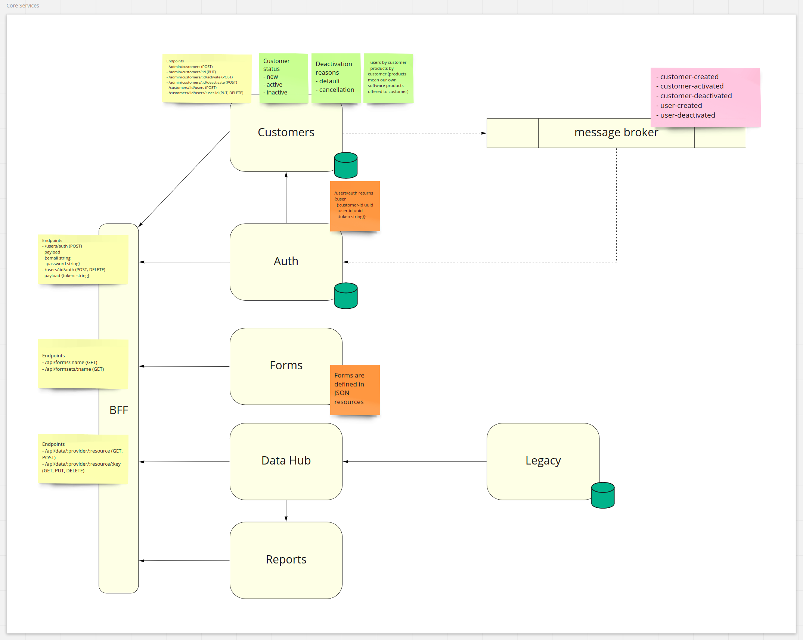

# WebMRP Core Services

This is a set of services that will enable the creation of webapps.

## Architecture Model


## Validations Endpoint
Validations endpoint 
```
/api/validation/:provider/:fn/:value
```
is a gateway to services that may be added to the system. It accetps `GET` or `PUT` requests. Validation params are
- *provider*: the validation service name
- *fn*: the service method that will be called
- *value*: the value that will be validated
